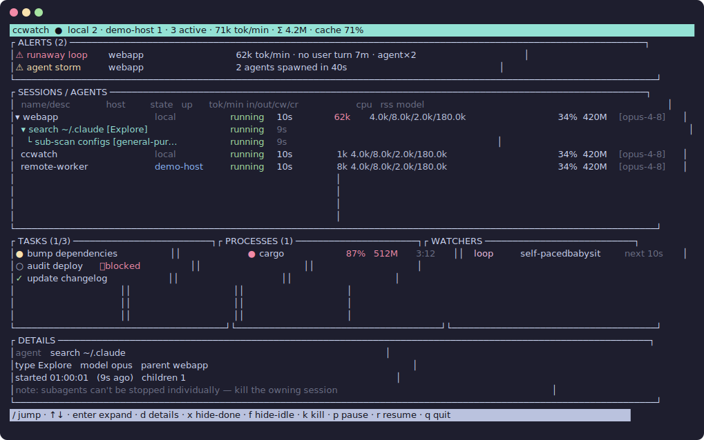
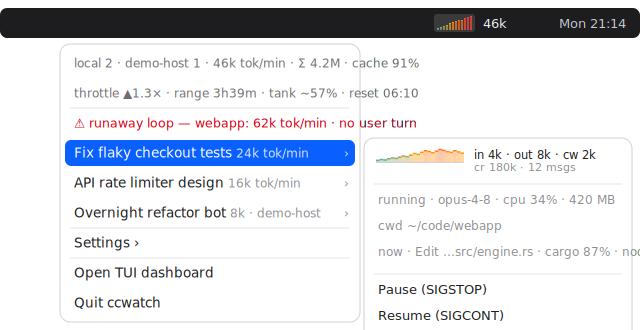

# ccwatch

[](https://github.com/jagajaga/ccwatch/actions/workflows/ci.yml)

Four Claude Code sessions on your laptop, another one on a server, half of them
running agents that spawn agents. Somewhere in there, tokens are burning — and
the first you hear of it is *"limit reached, resets at 03:00"*, right in the
middle of the thing you actually cared about.

ccwatch is mission control: a menu-bar fuel gauge and a terminal dashboard for
every session, agent, and process Claude runs — on every machine you own.





## The sixty-second tour

**The menu bar** is the glance. A live burn graph (teal: cruising, red: you're
flooring it) next to your throttle — `▼0.6×` means you'll coast past the limit
reset, `▲2.1×` means you'll hit the wall well before it. Click it: every
session with its own burn sparkline, what it's doing *right now* ("Edit
engine.rs", "cargo build 87%"), and Kill / Pause for the one that's gone feral.

**The terminal UI** is the cockpit. Every session across every machine —
state, last activity, burn rate, token breakdown, cpu/ram — with leak alerts
pinned on top: runaway loops, cache misses, agent storms, a session burning
while it claims to be idle. Expand a session to see its agents (background
ones show truthfully as *running*, not "done"). The bottom panes show its
todos, its in-flight tool calls and child processes, and its watchers.

| | | | |
|---|---|---|---|
| `/` jump to anything | `d` details | `s` sort | `enter` expand |
| `k` kill | `p`/`r` pause/resume | `f` hide idle | `x` hide finished |

## Quick start

```sh
cargo build --release     # or grab a release binary
./target/release/ccwatch           # terminal UI
./target/release/ccwatch-menubar   # menu-bar app
```

That's it. Both start the collector daemon themselves, and it cleans itself up
~15 s after the last one closes. No setup, no accounts, no telemetry —
everything stays on your machines.

## The Governor

The fuel gauge. Like a car's range estimate: keep flooring it and you run dry
early; ease off and you make it to the reset.

- **Tank** — how much of your 5-hour plan window remains. Here's the trick:
  ccwatch **learns your real limit from the 429s in your own history** — every
  time you've ever hit the wall, that's a measurement. Zero configuration; a
  `~` marks the estimate.
- **Throttle** — your burn vs. the pace that lands exactly at the reset.
- **Range** — minutes until empty at current speed, and a *"limit ahead"*
  alert with the collision time when range < reset.

It counts what you actually pay for (input + output + cache writes), summed
across every machine — because your server's agents drain the same account
your laptop does.

## Your servers too

```json
// ~/.claude/ccwatch/remotes.json
[{ "name": "my-server", "kind": "ssh", "target": "user@host" }]
```

Nothing to install on the remote — the daemon pipes a small Python probe over
ssh, which reads the remote `~/.claude` in place and reports back sessions,
burn, agents, processes. Needs ssh keys and python3, nothing else. Remote
sessions sit next to local ones and are killable (a TERM over ssh). A server
that stops answering becomes an alert, not a silent gap.

## Tuning

`~/.claude/ccwatch/config.toml`, all optional:

```toml
hourly_budget = 3_000_000     # personal cruise budget, tokens/hour
#window_budget = 200_000_000  # plan-window size; unset → learned from 429s
terminal = "iTerm"            # for "Open TUI dashboard"; auto-detected
burn_tokens_per_min = 40000   # where the graph turns red
```

## Under the hood

```
~/.claude (sessions, transcripts, tasks)      ssh → remote ~/.claude
                    │                                 │
                    ▼                                 ▼
                ccwatchd ····· one daemon: tails transcripts incrementally,
                    │          watches processes, computes rates + alerts
        unix socket │          + the Governor
          ┌─────────┴─────────┐
          ▼                   ▼
       ccwatch          ccwatch-menubar
```

Claude Code already writes everything worth knowing into `~/.claude` — ccwatch
just reads it well: only new bytes of each transcript, only the pids it cares
about, redraws only on change. Idle, the whole stack costs ~0% CPU.

Design notes: [docs/superpowers/specs](docs/superpowers/specs/2026-07-01-claude-code-observability-tui-design.md)
